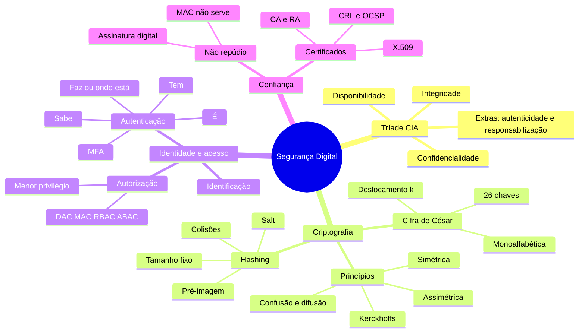
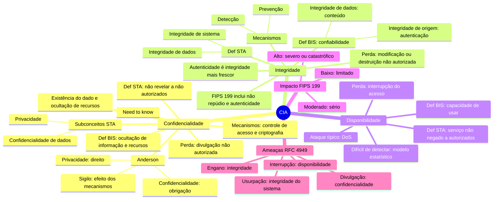
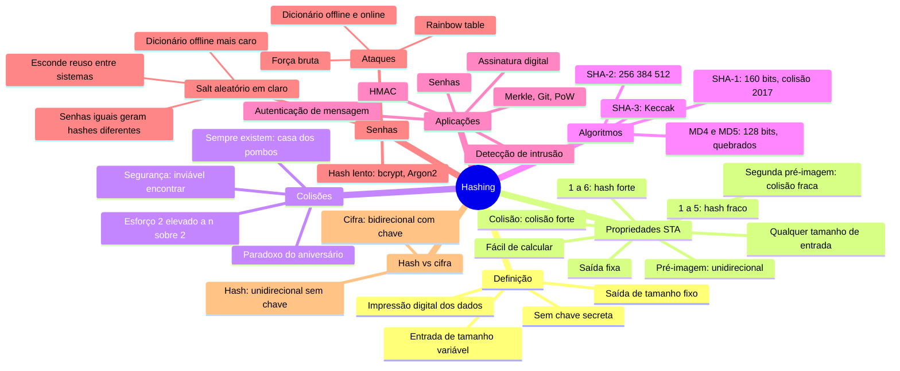
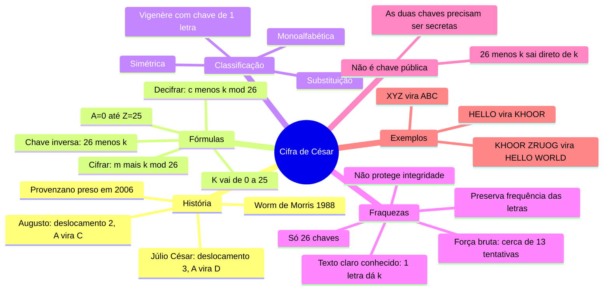
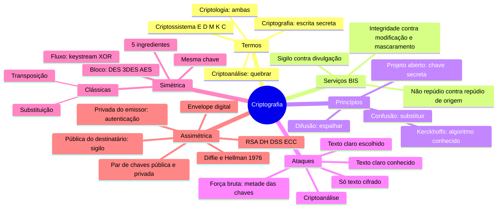
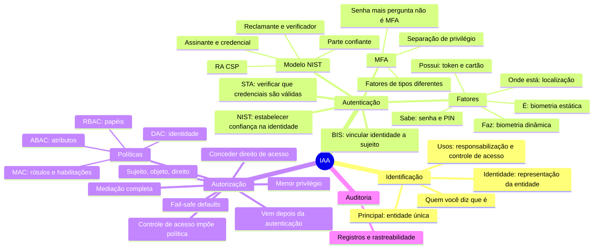
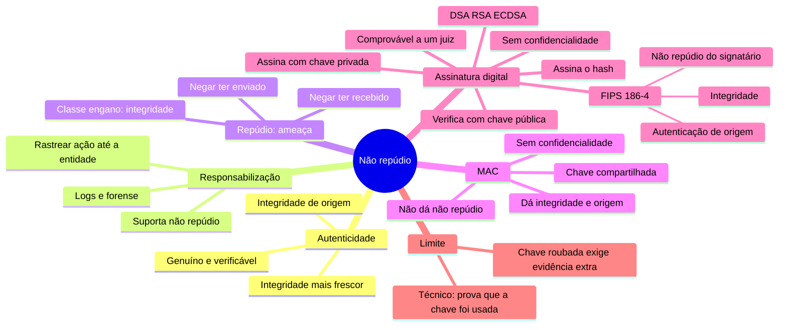
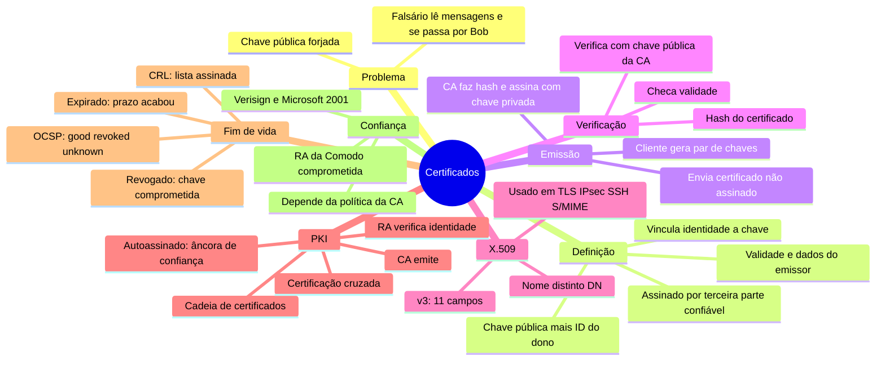

# Mapas mentais: Segurança Digital

> Feitos a partir dos resumos em `resumos/` (fontes: [STA], [BIS], [AND], [AT01], [AT03]). O Obsidian desenha os blocos `mermaid` como mapa mental no modo leitura.

---

## 0. Visão geral da prova

---

## 1. Tríade CIA

---

## 2. Hashing

---

## 3. Cifra de César

---

## 4. Princípios da criptografia

---

## 5. Identificação, Autenticação e Autorização

---

## 6. Autenticidade e Não Repúdio

---

## 7. Certificados digitais

